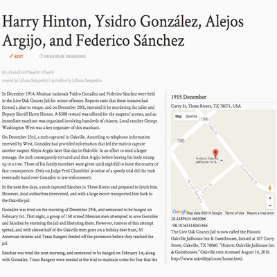
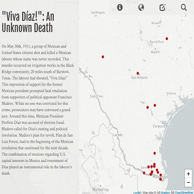

<!-- Main -->

<!-- One -->
<section id="one">
	

		<header class="major">
			<h2>Categories</h2>
		</header>
		
The projects below are broken up by type ranging from my digital projects to my academic writings.

		<ul class="actions">
			<li><a href="#coding" class="button scrolly">Coding</a></li>
			<li><a href="#acadwriting" class="button scrolly">Academic Writing</a></li>
			<li><a href="#hea" class="button scrolly">Higher Education Administration</a></li>
		</ul>
	

</section>

<!-- Two -->
<section id="two" class="spotlights">
	<h2 id="coding">Coding</h2>
	
	<section>
		
		

			

				<header class="major">
					<h3>Mapping Violence Data Collection Application</h3>
				</header>
				
A full-stack web application that enables humanities research to collect and store unstructured data on the acts of violence against Mexicans and Mexican Americans.

				<ul class="actions">
					<li><a href="/projects/mapping-violence-data" class="button">Learn more</a></li>
				</ul>
			

		

	</section>
	<section>
		
		

			

				<header class="major">
					<h3>Mapping Violence Visualization Prototype</h3>
				</header>
				
An interactive visualization of the narratives of loss of Mexicans and Mexican Americans at the hands of the Texas Rangers.

				<ul class="actions">
					<li><a href="generic.html" class="button">Learn more</a></li>
				</ul>
			

		

	</section>
	<section>
		
		

			

				<header class="major">
					<h3>Database of Indigenous Slavery in the Americas</h3>
				</header>
				
A full-stack project from the Center of Digital Scholarship that allows for the collection of data surrounding enslaved indigenous persons in North and South American circa 1300 to 1500.

				<ul class="actions">
					<li><a href="/projects/disa" class="button">Learn more</a></li>
				</ul>
			

		

	</section>
	<h2 class="center-align" id="acadwriting">Academic Writing</h2>
	
	<section>
		
		

			

				<header class="major">
					<h3>The Question(s) of Success:</h3>
					<h4><em>Understanding Racialized Conceptions of Success in Mexican and Jewish Acculturation</em></h4>
				</header>
				
A comparative analysis and close reading of <em>George Washington Gomez</em> by Chicano author Americo Paredes and <em>The Rise of David Levinsky</em> by Jewish immigrant Abraham Cahan.

				<ul class="actions">
					<li><a href="/writings/academic/gwg-rdl" class="button">Learn more</a></li>
				</ul>
			

		

	</section>
	<h2 class="center-align" id="hea">Higher Education Administration</h2>
	
	<section>
		
		

			

				<header class="major">
					<h3>Rebuilding the Residential Council</h3>
				</header>
				
A description of my work in rebuilding and chairing the Residential Council of Brown University.

				<ul class="actions">
					<li><a href="/projects/rescouncil" class="button">Learn more</a></li>
				</ul>
			

		

	</section>

</section>

